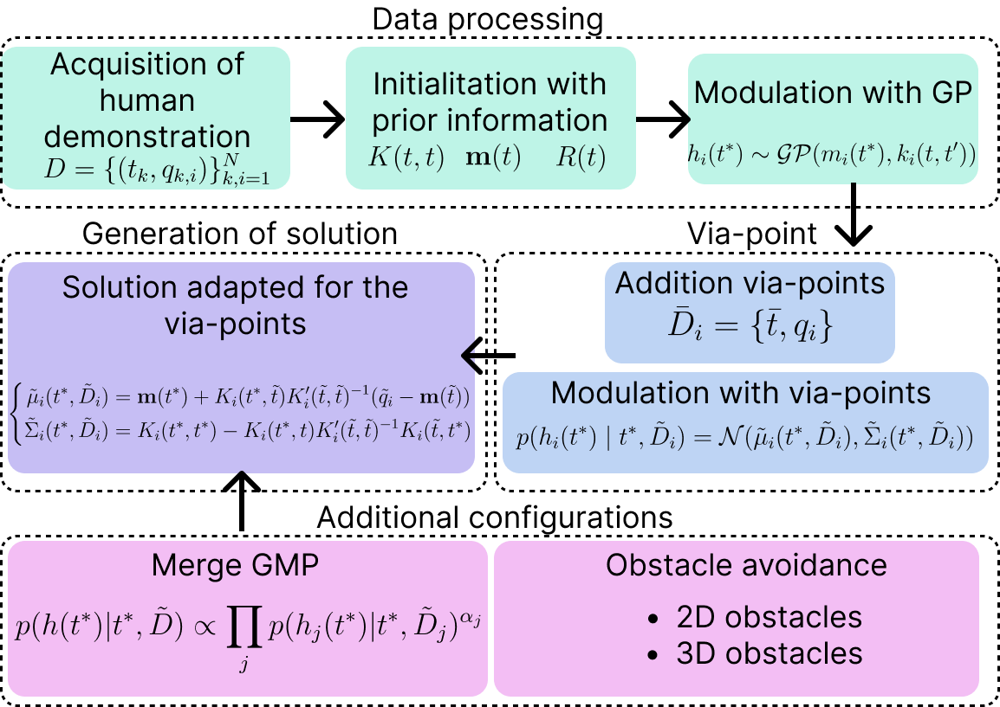
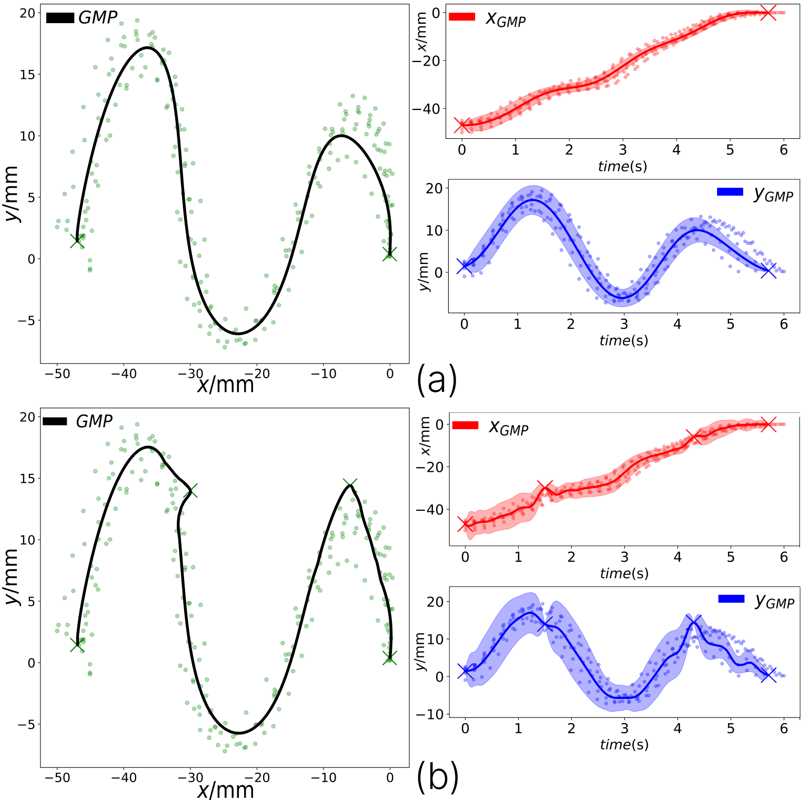
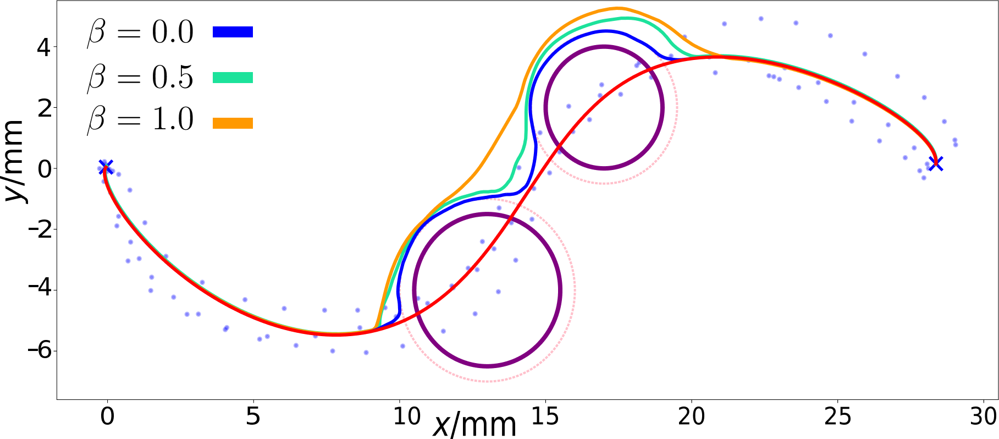
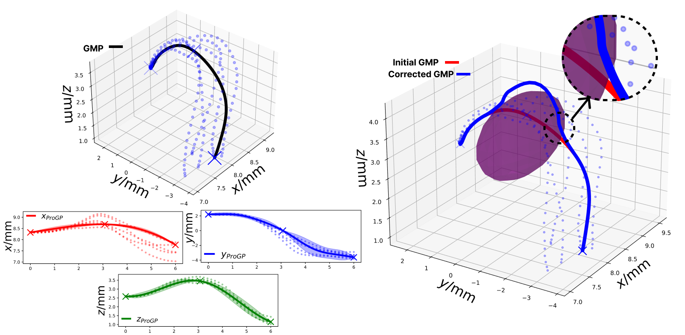
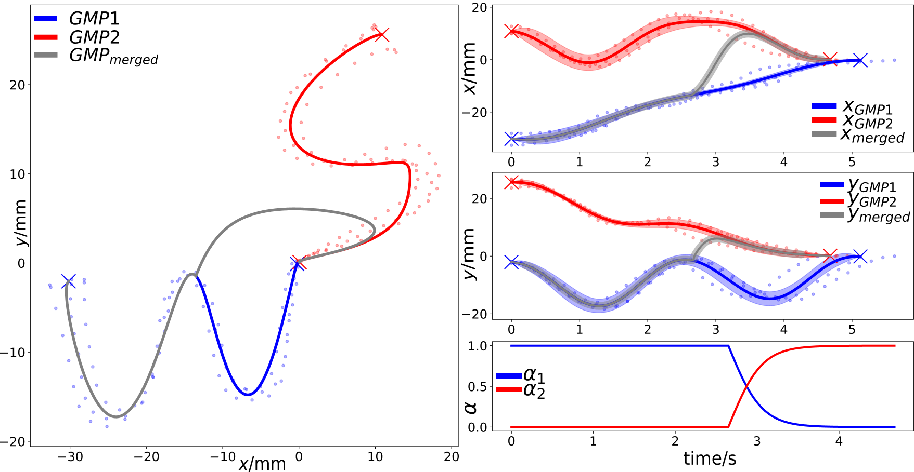

# **Learning of Movement Primitives by Gaussian Processes from Demonstrations**
<p align="center">
  
</p>

Currently, the use of Learning from Demonstration (LfD) techniques has proven effective for encoding human skills to solve specific tasks. Among all existing techniques, the use of algorithms based on movement primitives presents an effective way to encode basic robot movements. Most of these techniques learn through parametric approaches, which increases the demands for human effort and also limits reproduction accuracy. Additionally, many LfD techniques focus on working in static environments, without considering how the skill might change in the presence of obstacles in the environment. In this work, we present a non-parametric movement primitive generation algorithm based on the use of Gaussian Processes (GP), called Gaussian Movement Primitive (GMP). Unlike other techniques, our algorithm has a sufficient condition to ensure that the generated trajectory can pass through the desired points with 100% probability, as well as the ability to be combined analytically and to avoid obstacles that may appear in the environment. To verify its efficiency, comparisons have been made in simulations on the LASA and RAIL datasets against other state-of-the-art algorithms to show the advantages of the presented algorithm, as well as experiments in real environments with a robotic arm.

The developed method allows working both in the *N-dimensional joint space* and in the *Cartesian space*.

# Installation
To be used on your device, follow the installation steps below.

**Requierements:**
- There is a `requirements.txt` file with all the elements neccesary for the correct instalation.


## Install miniconda (highly-recommended)
It is highly recommended to install all the dependencies on a new virtual environment. For more information check the conda documentation for [installation](https://conda.io/projects/conda/en/latest/user-guide/install/index.html) and [environment management](https://conda.io/projects/conda/en/latest/user-guide/tasks/manage-environments.html). For creating the environment use the following commands on the terminal.

```bash
conda create -n mpGaussian python=3.8.18
conda activate mpGaussian
```

### Install repository
Clone the repository in your system.
```bash
git clone https://github.com/AdrianPrados/Gaussian-Movement-Primitive.git
```
The enter the directory and isnatll all the requierements:
```bash
cd Gaussian-Movement-Primitive
pip install -r requirements.txt
```

# **Algorithm execution**
There are different codes that you can try with our implementation:
- [`ProGP.py`](./ProGP.py): Provides the definition of the Gaussian Process class generated for the demonstration learning process.
- [`Exp_2d.py`](./Exp_2d.py): Provides an example of use for 2D examples. It uses the collision avoidance developed for the 2D experiments, provided in [`ObstacleAvoidance.py`](./ObstacleAvoidance.py). An example of the solutions generated is presented in the left image where the method works taken into account some via-points. Another examples show how the method generates a solution avoiding the obstacle.Depending of the $\beta$ value, the solution of the avoidance path is different.
<p align="center">
  
  
</p>

- [`Exp_3d.py`](./Exp_3d.py): Provides an example of use for 3D examples. It uses the collision avoidance developed for the 3D experiments, provided in [`ObstacleAvoidance3D.py`](./ObstacleAvoidance3D.py). An example of the solutions generated is presented in the next image.
<p align="center">
  
</p>

- [`blending.py`](./blending.py):This script allows to visualize the union process of two or more GPs generated with our algorithm. This allows to perform an information merging process using different union functions set by the value of $\alpha$. An example is provided in the next image:
<p align="center">
  
</p>

### **Experiments with robot manipulator**
To test the efficiency of the algorithm, experiments have been carried out with a manipulator in a real environment. For this purpose, a series of data have been taken by means of a kinesthetic demonstration and then tested using the method in both Cartesian space and configuration space. An example of the data collection is provided below:

<p align="center">
  
</p>

The video with the solution is provided on [Youtube](https://www.youtube.com/watch?v=kBT9ptGG024)

# Citation
If you use this code, please quote our works :blush:

In progress :construction_worker:

## Acknowledgement
This work was supported by Advanced Mobile dual-arm manipulator for Elderly People Attendance (AMME) (PID2022-139227OB-I00), funded by Ministerio de Ciencia e Innovacion.

This work has been developed in the [Mobile Robotics Group](https://github.com/Mobile-Robots-Group-UC3M) from RoboticsLab, at University Carlos III de Madrid.