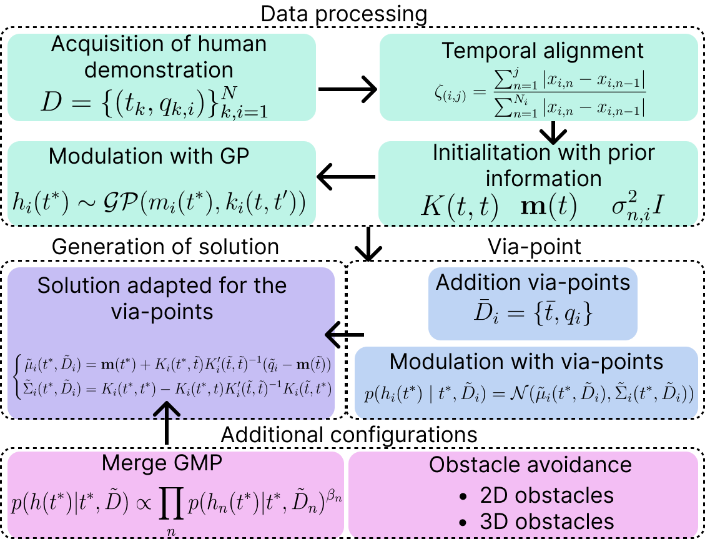
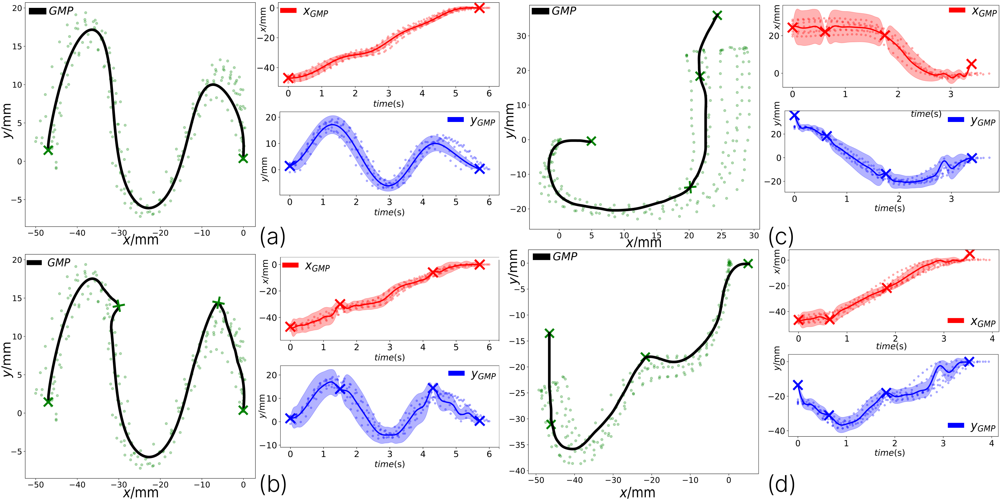
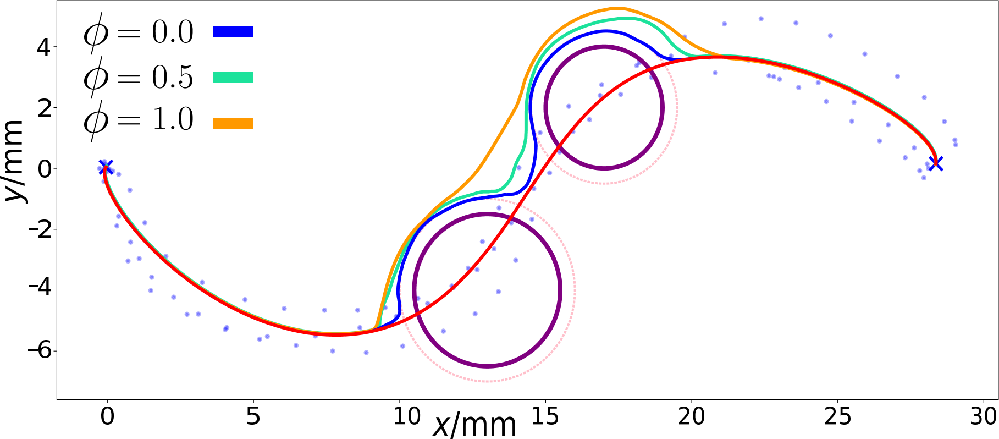
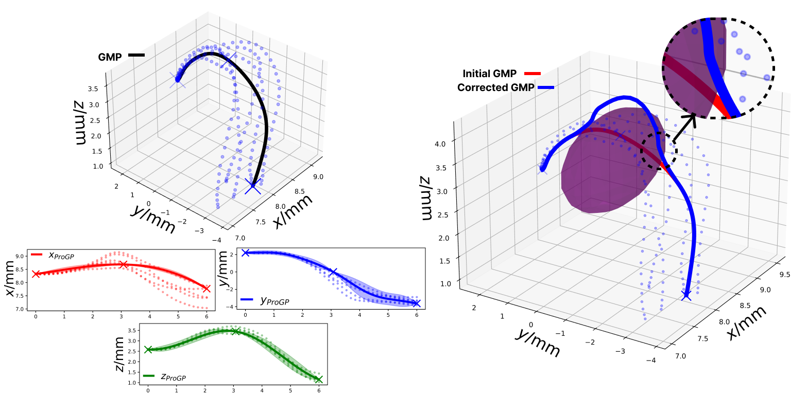
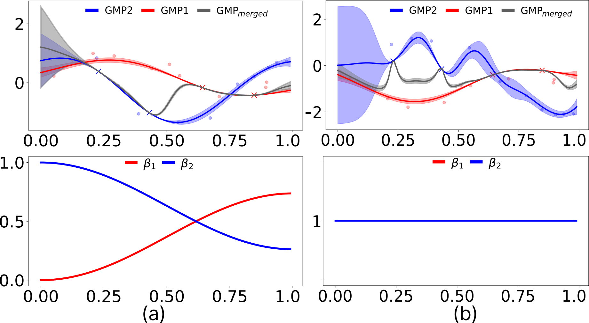
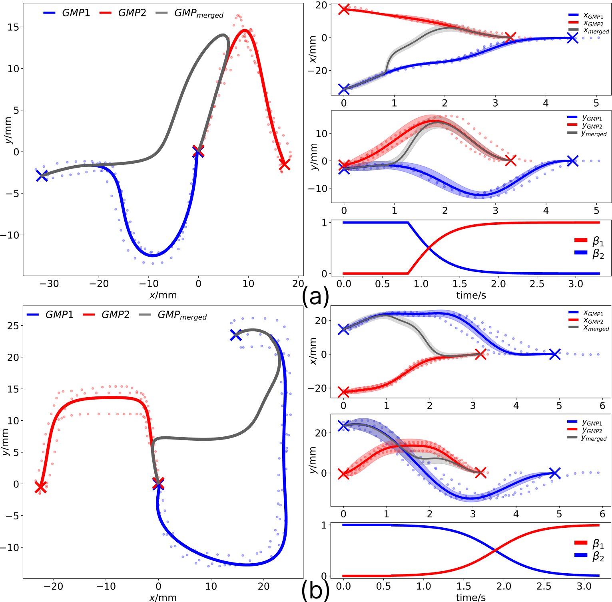
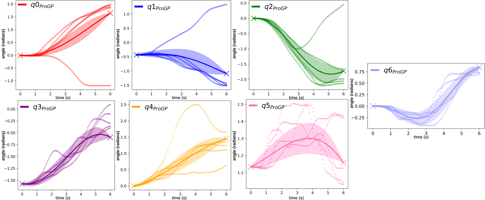
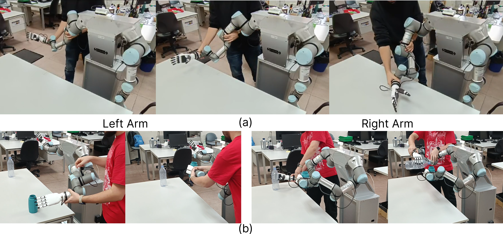

# **Learning of Movement Primitives by Gaussian Processes from Demonstrations**
<p align="center">
  
</p>

Currently, the use of Learning from Demonstration (LfD) techniques has proven to be effective for encoding human skills to solve specific tasks. Among all existing approaches, algorithms based on movement primitives offer an efficient method for encoding fundamental robot motions. Most of these methods rely on parametric approximations, which increases the need for user-provided information and limits the precision in task reproduction. Furthermore, many LfD techniques focus on static environments, without considering how the environment might change?such as the appearance of objects or obstacles that were not present during the data collection phase. This work presents a non-parametric movement primitive generation algorithm based on Gaussian Processes, called Gaussian Movement Primitive (GMP). Unlike other techniques, our algorithm explicitly considers via-points during the solution process, ensuring that the generated trajectory is free of uncertainty at those points. Additionally, it supports analytical combination, works in both Cartesian and configuration spaces, and can avoid obstacles that may appear in the environment. To validate its effectiveness, simulations were conducted on the LASA and RAIL datasets, comparing GMP with other widely used LfD algorithms for robotic task learning. Real-world experiments were also carried out using two different robotic manipulators. The algorithm shows improvements in the evaluation metrics used for comparison, while also demonstrating the ability to solve tasks in various dimensions, enabling it to operate in 2D or 3D Cartesian spaces as well as configuration spaces.

The developed method allows working both in the *N-dimensional joint space* and in the *Cartesian space*.

The full text is available in the journal [Engineering Applications of Artificial Intelligence](https://www.sciencedirect.com/science/article/pii/S0952197626015423?via%3Dihub)

# Installation
To be used on your device, follow the installation steps below.

**Requierements:**
- There is a `requirements.txt` file with all the elements neccesary for the correct instalation.


## Install miniconda (highly-recommended)
It is highly recommended to install all the dependencies on a new virtual environment. For more information check the conda documentation for [installation](https://conda.io/projects/conda/en/latest/user-guide/install/index.html) and [environment management](https://conda.io/projects/conda/en/latest/user-guide/tasks/manage-environments.html). For creating the environment use the following commands on the terminal.

```bash
conda create -n mpGaussian python=3.8.18
conda activate mpGaussian
```

### Install repository
Clone the repository in your system.
```bash
git clone https://github.com/AdrianPrados/Gaussian-Movement-Primitive.git
```
Then enter the directory and install all the requierements:
```bash
cd Gaussian-Movement-Primitive
pip install -r requirements.txt
```

# **Algorithm execution**
There are different codes that you can try with our implementation:
- [`ProGP.py`](./ProGP.py): Provides the definition of the Gaussian Process class generated for the demonstration learning process.
- [`Exp_2d.py`](./Exp_2d.py): Provides an example of use for 2D examples. It uses the collision avoidance developed for the 2D experiments, provided in [`ObstacleAvoidance.py`](./ObstacleAvoidance.py). An example of the solutions generated is presented in the left image where the method works taken into account some via-points. Another examples show how the method generates a solution avoiding the obstacle.Depending of the $\Phi$ value, the solution of the avoidance path is different.
<p align="center">
  
  
</p>

- [`Exp_3d.py`](./Exp_3d.py): Provides an example of use for 3D examples. It uses the collision avoidance developed for the 3D experiments, provided in [`ObstacleAvoidance3D.py`](./ObstacleAvoidance3D.py). An example of the solutions generated is presented in the next image.
<p align="center">
  
</p>

- [`blending.py`](./blending.py):This script allows to visualize the union process of two or more GPs generated with our algorithm. This allows to perform an information merging process using different union functions set by the value of $\alpha$. An example is provided in the next image:
<p align="center">
  
  
</p>

- [Exp_Joints.py](./Exp_Joints.py): This code allows the execution of the GMP algorithm in *N* dimensions, with each dimension representing a joint of the robotic arm to be controlled. The algorithm also supports the addition of via-points in the configuration space.
<p align="center">
  
</p>

### **Experiments with robot manipulator**
To test the efficiency of the algorithm, experiments have been carried out with two robotic platforms. For this purpose, a series of data have been taken by means of a kinesthetic demonstration and then tested using the method in both Cartesian space and configuration space. An example of the data collection for the IIWA platforma and the ADAM robot is provided below:

<p align="center">
  
</p>
<p align="center">
  
</p>

The video with the solution for the IIWA platform in Cartesian and joint space is provided on [IIWA](https://youtu.be/0Pok3CNs21s) and the solution for ADAM solving tasks with multiple obstacles in Cartesian space and a pouring water task using the joint space for both arms is provided in [ADAM](https://youtu.be/r3a-Z35ygXs)

# Citation
If you use this code, please quote our works :blush:

```
@article{PRADOS2026115258,
title = {Learning of Movement Primitives by Gaussian Processes from demonstrations},
journal = {Engineering Applications of Artificial Intelligence},
volume = {179},
pages = {115258},
year = {2026},
issn = {0952-1976},
doi = {https://doi.org/10.1016/j.engappai.2026.115258},
url = {https://www.sciencedirect.com/science/article/pii/S0952197626015423},
author = {Adrian Prados and Luis Moreno and Ramon Barber}
}
```

## Acknowledgement
This work was supported by Advanced Mobile dual-arm manipulator for Elderly People Attendance (AMME) (PID2022-139227OB-I00), funded by Ministerio de Ciencia e Innovacion.

This work has been developed in the [Mobile Robotics Group](https://github.com/Mobile-Robots-Group-UC3M) from RoboticsLab, at University Carlos III de Madrid.
